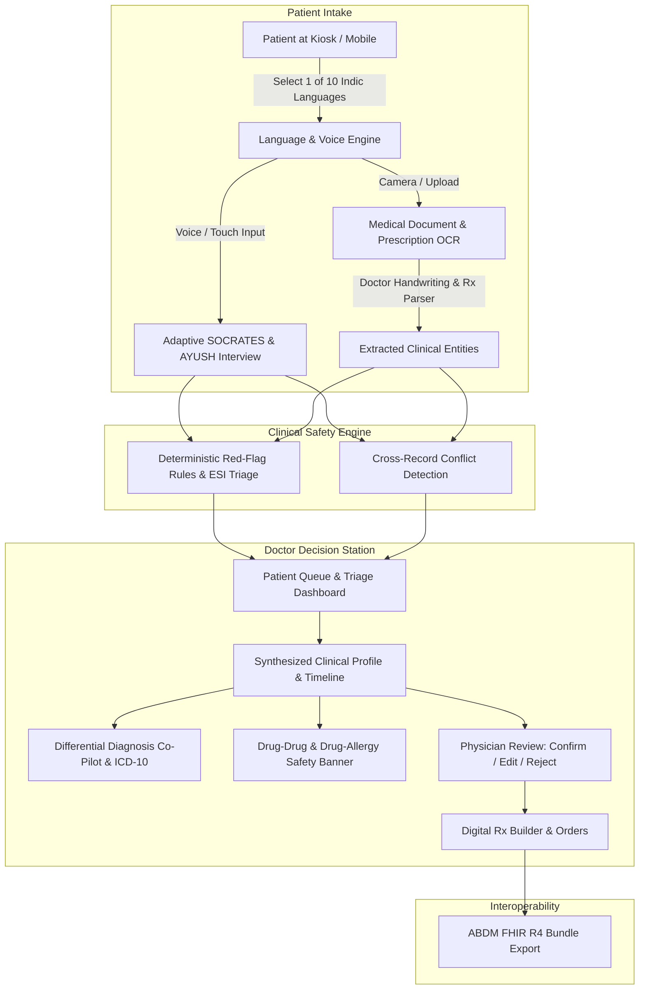

# ArogyaDarpan (आरोग्यदर्पण)

> **AI-Powered Multilingual Pre-Consultation Clinical Intake, Prescription OCR & Care-Continuity Platform**
> 
> *Your complete clinical story, structured before the consultation begins.*
> 
> **Core Clinical Philosophy**: *AI prepares. AI explains. The doctor decides.*

---

## 🌟 Overview

**ArogyaDarpan** is an advanced, production-grade clinical pre-consultation and doctor decision-support platform designed for **Smart India Hackathon (SIH)**. 

In high-volume OPDs and rural health centers, doctors spend the first 5–10 minutes of every consultation transcribing basic history and deciphering fragmented old paper records. ArogyaDarpan eliminates this bottleneck by gathering, validating, and structuring patient history **before** the patient enters the consultation room — through voice, touch, and intelligent document scanning — and delivering a synthesized, triaged clinical summary to the doctor's decision station.

---

## 🚀 Key Capabilities

### 1. 🇮🇳 10 Indian Languages Full-Stack Localization
- Complete, native-script translation and voice assistance across **10 official Indian languages**:
  - **English** (`en`)
  - **Hindi** (`hi` — हिन्दी)
  - **Punjabi** (`pa` — ਪੰਜਾਬੀ)
  - **Bengali** (`bn` — বাংলা)
  - **Tamil** (`ta` — தமிழ்)
  - **Telugu** (`te` — తెలుగు)
  - **Marathi** (`mr` — मराठी)
  - **Gujarati** (`gu` — ગુજરાતી)
  - **Kannada** (`kn` — ಕನ್ನಡ)
  - **Malayalam** (`ml` — മലയാളം)
- Dynamic runtime language switching across all Patient journeys, Kiosk interfaces, and Doctor Decision Stations with **zero untranslated strings**.

### 2. 🎙️ Multimodal Voice & Audio-Guided Patient Intake
- **Voice-First Interaction**: Integrated Web Speech API speech-to-text with real-time breathing microphone pulse animations.
- **Audio TTS Narration**: Text-to-speech auto-reading for consent, questions, and option cards — enabling independent intake for rural, elderly, and low-literacy patients.
- **Adaptive SOCRATES Question Branching**: Dynamically branches clinical questions based on chief complaint (*Site, Onset, Character, Radiation, Associated symptoms, Timing, Exacerbating/Relieving factors, Severity*).

### 3. 🌿 Dual Clinical Intake Tracks (Modern Medicine + AYUSH)
- **Allopathic Track**: Structured Review of Systems (ROS), SOCRATES symptom inquiry, chronic condition tracking, surgical history, and emergency red-flag triggers.
- **AYUSH Dashavidha Pariksha (दशविध परीक्षा)**: Holistic evaluation covering:
  - *Prakriti* (Constitutional dosha assessment — Vata, Pitta, Kapha)
  - *Vikriti* (Current morbidity state)
  - *Sara* (Tissue vitality / Dhatu strength)
  - *Samhanana* (Body build & compactness)
  - *Pramana* (Anthropometric proportion)
  - *Satmya* (Adaptability & dietary tolerance)
  - *Sattva* (Mental resilience & temperament)
  - *Ahara Shakti* (Digestive capacity & Agni state)
  - *Vyayama Shakti* (Physical endurance & exercise capacity)
  - *Vaya* (Age and chronological vitality stage)

### 4. 📄 Hybrid Offline/Online Medical Prescription OCR
- **Doctor Handwriting & Rx Abbreviation Parser**:
  - Extracts medication names, dosage forms (tablets, capsules, syrups, drops), strengths (`mg`, `mcg`, `ml`, `IU`), and durations (`days`, `weeks`).
  - Deciphers clinical frequency abbreviations (`OD`, `BD`, `TDS`, `QID`, `SOS`, `HS`, `stat`, `PRN`, `Q4H`, `1-0-1`, `1-1-1`).
  - Detects intake instructions (`Before food / AC`, `After food / PC`, `With water`, `At bedtime`).
- **Strict Medical Entity Validation**:
  - Validates document authenticity by inspecting doctor name, clinic/hospital stamp, diagnosis, or recognized medication entities.
  - Automatically rejects non-medical imagery (e.g. memes, artistic prints) with clear actionable feedback.
- **Hybrid Offline Fallback**: Tesseract.js in-browser engine ensures OCR operates reliably even during connectivity interruptions in remote primary health centers (PHCs).

### 5. 🚨 Deterministic Red-Flag Safety & Conflict Rules Engine
- **Emergency Severity Index (ESI) Triage**: Deterministic, rule-based safety layer (strictly NO probabilistic LLM hallucination for life-threatening emergencies) that instantly flags acute conditions (e.g., *Chest Pain + Left Arm Radiation + Dyspnea*).
- **Cross-Record Conflict Detection**: Cross-references patient voice responses against scanned records and historical data to catch discrepancies (e.g., Patient states *"No known allergies"* while a 2024 prescription documents *"Penicillin Allergy"*).

### 6. 🩺 Doctor Decision Station & Clinical Co-Pilot
- **Differential Diagnosis Widget**: Generates prioritized differential diagnosis candidates mapped to ICD-10 codes, probability match scores, and recommended diagnostic workups.
- **Real-Time Drug Safety & Interaction Engine**: Proactively detects Drug-Drug interactions and Drug-Allergy contraindications (e.g., Cephalosporin cross-allergy with Penicillin, NSAID + Anticoagulant bleeding risks).
- **Digital Prescription Builder**: Doctor can review, verify, add new medications, and finalize clinical plans with a single click.
- **Doctor-in-the-Loop Audit Trail**: Every AI-extracted observation requires physician verification (**Confirm**, **Edit**, or **Reject**), creating an auditable provenance trail.
- **ABDM / FHIR R4 Export**: One-click generation of standardized Ayushman Bharat Digital Mission (ABDM) compatible FHIR R4 clinical bundles (`Composition`, `Patient`, `Condition`, `MedicationStatement`, `Observation`, `AllergyIntolerance`).

### 7. 🫀 Kiosk & Bionic Telemetry View
- **Visual Organ-by-Organ Health Map**: Interactive bionic body view featuring organ emojis (🫁 Lungs, 🫀 Heart, 🟤 Liver, 🩸 Blood/Vessels, 🧠 Brain) and live physiological status badges for fast OPD triage.

---

## 🛠️ Technology Stack

| Layer | Technologies |
|---|---|
| **Frontend Framework** | React 19, Vite 8, React Router v6 |
| **Styling & Design** | Tailwind CSS v4, Custom HSL Clinical Design Tokens, Glassmorphism UI |
| **Animations & Icons** | Framer Motion, Lucide React |
| **Voice & Speech** | Web Speech API (`SpeechRecognition`, `SpeechSynthesis`) with fallback acoustic visualizer |
| **Client-Side OCR** | Tesseract.js (Offline), Regex-based Medical Entity & Abbreviation Tokenizer |
| **State & Localization** | React Context API, Custom 10-Language Translation Engine |
| **Standards & Interop** | HL7 FHIR R4, ABDM (Ayushman Bharat Digital Mission) JSON Specifications |
| **Backend (Optional API)** | Node.js, Express.js, MongoDB / Mongoose |

---

## 🏗️ Architecture & Data Flow



---

## 📂 Project Structure

```text
ArogyaDarpan_Clean_Multilingual_UI/
├── index.html                           # App entry point with fonts and meta tags
├── vite.config.js                       # Vite configuration with React & Tailwind plugins
├── package.json                         # Project dependencies & build scripts
├── src/
│   ├── components/                      # Reusable UI & Clinical Components
│   │   ├── Button.jsx                   # Standardized accessible button system
│   │   ├── Card.jsx                     # Glassmorphic card surfaces
│   │   ├── Badge.jsx                    # Severity, status, and triage tags
│   │   ├── ProgressBar.jsx              # Multistep intake progress bar
│   │   ├── VoiceRecorder.jsx            # Voice input with audio pulse visualizer
│   │   ├── ConfidenceBadge.jsx          # OCR extraction confidence meter
│   │   ├── ClinicalSignalCard.jsx       # Red-flag & discrepancy alert cards
│   │   ├── CompletenessTracker.jsx       # SOCRATES history completeness score
│   │   ├── VerificationButtons.jsx      # Doctor Confirm / Edit / Reject actions
│   │   ├── DifferentialDiagnosisWidget.jsx # ICD-10 candidates & test suggestions
│   │   ├── DrugSafetyBanner.jsx         # Drug-Drug & Drug-Allergy safety alerts
│   │   ├── KioskView.jsx                # High-throughput visual kiosk display
│   │   ├── Timeline.jsx                 # Longitudinal patient health timeline
│   │   ├── LoadingState.jsx             # Shimmer loaders & clinical skeletons
│   │   └── ConnectionStatus.jsx         # Network status & offline banner
│   ├── context/
│   │   ├── LanguageContext.jsx          # 10-Language state manager & TTS handler
│   │   └── ConsultationContext.jsx      # Live intake & patient session store
│   ├── data/
│   │   ├── questionBank.js              # Adaptive clinical & AYUSH question matrix
│   │   ├── clinicalRules.js             # Deterministic ESI triage & conflict rules
│   │   ├── demoPatients.js              # Golden demo patient records (Rahul, Simran, Aman)
│   │   ├── bionicData.js                # Organ telemetry & vital indicators
│   │   ├── translations.js              # Core UI translations
│   │   ├── coreUiTranslations.js        # Navigation, headers, and buttons translations
│   │   ├── journeyTranslations.js       # Patient intake screens translations
│   │   └── supplementalTranslations.js  # Doctor station, differential diagnosis & kiosk translations
│   ├── services/
│   │   ├── ocrService.js                # Document OCR orchestrator
│   │   ├── medicalPrescriptionOcr.js    # Doctor handwriting & abbreviation extractor
│   │   ├── audioTtsService.js           # Multi-accent speech synthesis
│   │   └── abdmFhirService.js           # FHIR R4 Bundle generator
│   ├── pages/
│   │   ├── LandingPage.jsx              # Landing hero, problem statement & workflow
│   │   ├── DemoPage.jsx                 # SIH Judge evaluation portal
│   │   ├── patient/                     # Patient Intake Journey
│   │   │   ├── LanguageSelection.jsx    # 10 Indic languages grid
│   │   │   ├── ConsentScreen.jsx        # Informed consent with audio readout
│   │   │   ├── PatientIdentification.jsx# ABHA ID / Mobile verification
│   │   │   ├── InterviewScreen.jsx      # Adaptive voice interview (SOCRATES + AYUSH)
│   │   │   ├── DocumentUpload.jsx       # Camera capture & file upload
│   │   │   ├── DocumentReview.jsx       # OCR entity verification & correction
│   │   │   ├── ConfirmationScreen.jsx   # Patient summary & conflict warning
│   │   │   └── CompletionScreen.jsx     # Token generation & kiosk handoff
│   │   └── doctor/                      # Doctor Decision Station
│   │       ├── DoctorDashboard.jsx      # OPD live queue, triage badges & metrics
│   │       └── PatientDetail.jsx        # 3-column clinical station with full co-pilot
│   ├── App.jsx                          # Route definitions & layout wrappers
│   ├── main.jsx                         # Application bootstrapping
│   └── index.css                        # CSS design tokens, themes & animations
```

---

## ⚡ Quick Start & Installation

### Prerequisites
- **Node.js** (v18.0.0 or higher recommended)
- **npm** (v9.0.0 or higher)

### 1. Installation
```bash
# Clone the repository
git clone https://github.com/TruCoded/arogyadarpan.git

# Navigate to project directory
cd arogyadarpan

# Install dependencies
npm install
```

### 2. Run Development Server
```bash
npm run dev
```
Open your browser at **`http://localhost:5173`** (or the port displayed in terminal).

### 3. Production Build & Validation
```bash
npm run build
npm run preview
```

> **Note**: The application includes a self-contained in-memory demo state with pre-configured clinical records. It runs completely standalone out of the box with zero external database configuration required.

---

## 🎯 Evaluator / SIH Judge Walkthrough (3-Minute Golden Path)

Follow this streamlined workflow to experience the full end-to-end capability of ArogyaDarpan:

1. **Launch Evaluation Portal**:
   - Navigate to `/demo` or click **"Try Demo"** on the landing page.
2. **Select Language**:
   - Switch language to **Hindi (हिन्दी)**, **Punjabi (ਪੰਜਾਬੀ)**, or any of the 10 supported Indic languages to verify live localization.
3. **Patient Identification**:
   - Select **Rahul Sharma** (Demo Patient with acute chest symptoms).
4. **Adaptive Voice Intake**:
   - Review the **SOCRATES Completeness Tracker** on the left.
   - Click the microphone icon to test voice input or choose quick-select buttons:
     - Complaint: *Chest pain* → Onset: *2-3 days* → Severity: *7/10* → Radiation: *Left arm* → Breathlessness: *Yes*.
   - **Observe**: The **Priority Clinical Review Required (ESI Level 2)** alert triggers immediately.
5. **Document OCR & Prescription Parsing**:
   - Experience the prescription scanning step where medications (e.g. *Metformin 500mg BD*, *Atorvastatin 20mg HS*) are extracted with confidence indicators.
6. **Cross-Record Conflict Detection**:
   - On the Confirmation screen, observe the **Allergy Conflict Alert**: Patient answered *"No allergy"*, but historical record flags a *"Penicillin allergy (2024)"*.
7. **Doctor Decision Station**:
   - Switch to the **Doctor Portal** (`/doctor`).
   - Open **Rahul Sharma**'s record from the triage queue.
   - Inspect the **Differential Diagnosis Co-Pilot** showing ICD-10 candidates (*I20.0 Unstable Angina (88%)*, *I21.9 Acute Coronary Syndrome (76%)*) and suggested diagnostic orders (*12-lead ECG*, *Troponin-I*).
   - Inspect the **Drug Safety Banner** warning against prescribing beta-lactam antibiotics due to verified penicillin allergy.
   - Test **Physician Verification** by clicking *Confirm / Edit / Reject* on clinical items.
   - Click **"Export to ABDM"** to view and download the standardized **FHIR R4 JSON Bundle**.

---

## 🌐 Supported Languages Matrix

| Language | Native Script | Code | Voice STT | Audio TTS | Full UI |
|---|---|---|:---:|:---:|:---:|
| **English** | English | `en` | ✅ | ✅ | ✅ |
| **Hindi** | हिन्दी | `hi` | ✅ | ✅ | ✅ |
| **Punjabi** | ਪੰਜਾਬੀ | `pa` | ✅ | ✅ | ✅ |
| **Bengali** | বাংলা | `bn` | ✅ | ✅ | ✅ |
| **Tamil** | தமிழ் | `ta` | ✅ | ✅ | ✅ |
| **Telugu** | తెలుగు | `te` | ✅ | ✅ | ✅ |
| **Marathi** | मराठी | `mr` | ✅ | ✅ | ✅ |
| **Gujarati** | ગુજરાતી | `gu` | ✅ | ✅ | ✅ |
| **Kannada** | ಕನ್ನಡ | `kn` | ✅ | ✅ | ✅ |
| **Malayalam** | മലയാളം | `ml` | ✅ | ✅ | ✅ |

---

## 🛡️ Clinical Governance & Safety Guarantees

1. **Human-in-the-Loop Governance**: AI never makes unilateral clinical diagnoses or prescriptions. AI organizes, extracts, and explains; the licensed physician validates and authorizes.
2. **Deterministic Emergency Rule Layer**: Acute triage signals utilize deterministic rule evaluations based on standard ESI criteria to guarantee zero hallucination risk during emergencies.
3. **Explicit Uncertainty Modeling**: Unreported or unasked symptoms are explicitly designated as *"Not documented / Unconfirmed"*, never converted to false negatives (*"No history"*).
4. **Source Provenance & Traceability**: Every clinical insight, extracted drug, and allergy flag displays its exact origin (voice interview timestamp or document OCR snippet).
5. **Data Privacy & ABDM Compliance**: Patient data is structured in compliance with National Digital Health Mission (NDHM) guidelines using HL7 FHIR R4 schemas.

---

## 👥 Contributors & Acknowledgements

Built with ❤️ for **Smart India Hackathon (SIH) 2026** by the **ArogyaDarpan Development Team**.

- **GitHub Repository**: [TruCoded/arogyadarpan](https://github.com/TruCoded/arogyadarpan)
- **SIH Mirror**: [TruCoded/arogyadarpansih](https://github.com/TruCoded/arogyadarpansih)
